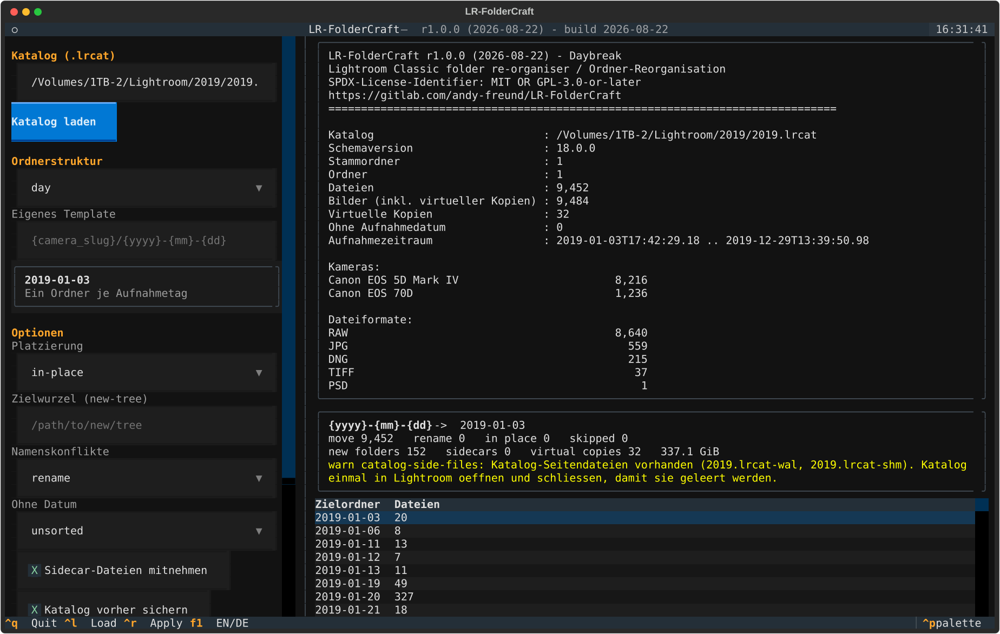

# LR-FolderCraft

**Ordnerstrukturen in Adobe Lightroom Classic neu sortieren — ohne die Katalogverbindung zu verlieren.**

[](CHANGELOG.md)
[](CHANGELOG.md)
[](pyproject.toml)
[](LICENSE)

🇬🇧 **[This page in English](README.md)** · 📚 [Dokumentation](docs/de/) · [Documentation in English](docs/en/)

---

## Das Problem

Die Lightroom-Bibliothek ist über die Jahre gewachsen und besteht aus einigen
Jahresordnern mit jeweils mehreren tausend Bildern. Gewünscht wären
Tagesordner — oder Kameraordner, oder Kalenderwochen. Verschiebt man die
Dateien aber im Finder oder Explorer, reißt jede Katalogverbindung ab, und
zehntausend Fotos von Hand im Ordner-Bedienfeld zu sortieren ist kein Plan.

## Was das Werkzeug tut

LR-FolderCraft verschiebt die Dateien **und** schreibt den Katalog in einem
Vorgang um. Erhalten bleiben:

- ✅ Entwicklungseinstellungen und der komplette Verlauf
- ✅ Virtuelle Kopien (sie folgen ihrem Master automatisch)
- ✅ Sammlungen, Stichwörter, Markierungen, Bewertungen, Farbmarkierungen
- ✅ Stapel, Vorschauen, Smart-Vorschauen
- ✅ XMP-Sidecar-Dateien, die mit ihrem Foto mitwandern

Am Katalog ändern sich nur zwei Dinge: neue Zeilen in `AgLibraryFolder` und ein
anderer Wert in `AgLibraryFile.folder`. Die Bildzeilen werden nie angefasst —
genau deshalb kann an den Bearbeitungen nichts verloren gehen.



## Schnellstart

```bash
git clone https://gitlab.com/andy-freund/LR-FolderCraft.git
cd LR-FolderCraft
./install/install-macos.sh              # macOS und Linux
# Windows: powershell -ExecutionPolicy Bypass -File .\install\install-windows.ps1
```

Danach, **mit geschlossenem Lightroom Classic**:

```bash
lrfc info  /Volumes/Fotos/2019/2019.lrcat        # nur lesen, nur ansehen
lrfc plan  /Volumes/Fotos/2019/2019.lrcat -s day # zeigt genau, was passieren würde
lrfc apply /Volumes/Fotos/2019/2019.lrcat -s day # führt es aus
```

Oder die interaktive Oberfläche:

```bash
lrfc tui
```

`plan` schreibt nichts. Ausgabe prüfen, dann `apply` starten.

## Ordnerstrukturen

Eine Struktur ist eine Liste von Ebenen; jede Ebene ist ein Template. Zwölf
Vorlagen sind eingebaut:

| Vorlage | Ergebnis |
| --- | --- |
| `day` | `2019-01-03` |
| `year/day` | `2019/2019-01-03` |
| `year/month/day` | `2019/01/03` |
| `year/week` | `2019/W01` |
| `iso-week` | `2019-W01` |
| `camera/day` | `canon-eos-70d/2019-01-03` |
| `day/camera` | `2019-01-03/canon-eos-70d` |
| `camera/year/month/day` | `canon-eos-70d/2019/01/03` |
| `year/quarter/month` | `2019/Q1/01` |
| `year/month-name` | `2019/01 Januar` |

`lrfc presets` zeigt alle Vorlagen, `lrfc tokens` alle Platzhalter.

Beliebige Kombinationen sind möglich — Ebenen mit `/` trennen:

```bash
lrfc plan KATALOG -s '{camera_slug}/{iso_year}-W{iso_week}'
lrfc plan KATALOG -s '{yyyy}/{mm} {month_name}/{dd} {weekday_short}'
```

Verfügbare Platzhalter sind unter anderem `{yyyy} {yy} {mm} {m} {dd} {d} {hh}
{mi} {month_name} {month_short} {quarter} {iso_week} {iso_year} {weekday}
{weekday_short} {doy} {camera} {camera_slug} {camera_sn} {lens} {lens_slug}
{format} {ext} {orig_folder}`.

Mit `--lang de` sind Monats- und Wochentagsnamen deutsch.

## Sicherheit

Das Werkzeug verändert die Katalogdatenbank. Es ist so gebaut, dass ein Fehler
keine halb sortierte Bibliothek hinterlassen kann:

1. **Vorprüfungen** — Lightroom geschlossen, Schreibrechte, freier Speicher.
2. **Geprüftes Backup** — der Katalog wird kopiert und die Kopie per SHA-256
   verifiziert, bevor irgendetwas anderes geschieht.
3. **Vorbereitete Transaktion** — alle Katalogänderungen werden erstellt, aber
   noch nicht bestätigt.
4. **Journalisierte Verschiebungen** — jede Dateibewegung wird protokolliert,
   geflusht und per fsync gesichert, *bevor* sie versucht wird.
5. **Commit zuletzt** — der Katalog wird erst bestätigt, wenn alle Dateien
   angekommen sind.
6. **Automatischer Rollback** — scheitert eine Bewegung, wird die
   Katalogtransaktion verworfen und alle bereits verschobenen Dateien werden
   zurückgelegt.
7. **Verifikation** — danach wird jeder Katalogpfad gegen die Platte geprüft.

`lrfc undo JOURNAL` macht einen abgeschlossenen Lauf rückgängig.

Vorhandene Dateien werden nie überschrieben. Ein Namenskonflikt wird durch
Umbenennen gelöst (der Katalog wird entsprechend nachgeführt), alternativ
`--conflict skip`.

**Trotzdem immer ein unabhängiges Backup vorhalten.** Siehe
[docs/de/sicherheit.md](docs/de/sicherheit.md).

## Voraussetzungen

- Python 3.9 oder neuer (macOS bringt eine passende Version mit)
- Adobe-Lightroom-Classic-Katalog, Schemaversion 11.x–19.x
  (verifiziert gegen 18.0.0 / Lightroom Classic 14)
- Lightroom Classic **geschlossen**, während das Werkzeug läuft

Die Kommandozeile benötigt nur die Standardbibliothek. Die TUI kommt mit
[Textual](https://textual.textualize.io/).

## Dokumentation

| | Deutsch | English |
| --- | --- | --- |
| Überblick | [docs/de/index.md](docs/de/index.md) | [docs/en/index.md](docs/en/index.md) |
| Installation | [installation.md](docs/de/installation.md) | [installation.md](docs/en/installation.md) |
| Bedienung | [bedienung.md](docs/de/bedienung.md) | [usage.md](docs/en/usage.md) |
| Strukturen & Platzhalter | [strukturen.md](docs/de/strukturen.md) | [structures.md](docs/en/structures.md) |
| Funktionsweise | [funktionsweise.md](docs/de/funktionsweise.md) | [how-it-works.md](docs/en/how-it-works.md) |
| Sicherheit & Wiederherstellung | [sicherheit.md](docs/de/sicherheit.md) | [safety.md](docs/en/safety.md) |
| Architektur | [architektur.md](docs/de/architektur.md) | [architecture.md](docs/en/architecture.md) |
| Weiterentwicklung | [entwicklung.md](docs/de/entwicklung.md) | [development.md](docs/en/development.md) |
| Versionierung | [versionierung.md](docs/de/versionierung.md) | [versioning.md](docs/en/versioning.md) |
| FAQ | [faq.md](docs/de/faq.md) | [faq.md](docs/en/faq.md) |
| Offene Punkte | [offene-punkte.md](docs/de/offene-punkte.md) | [open-issues.md](docs/en/open-issues.md) |
| Prompts | [prompts.md](docs/de/prompts.md) | [prompts.md](docs/en/prompts.md) |

## Lizenz

Doppelt lizenziert: **MIT ODER GPL-3.0-or-later**. Nach Wahl anwendbar.
Siehe [LICENSE](LICENSE), [LICENSE-MIT](LICENSE-MIT), [LICENSE-GPL-3.0](LICENSE-GPL-3.0).

## Haftungsausschluss

Bereitstellung ohne jede Gewährleistung. Adobe, Lightroom und Lightroom Classic
sind Marken der Adobe Inc. Dieses Projekt steht in keiner Verbindung zu Adobe
Inc. und wird von Adobe weder unterstützt noch empfohlen.
