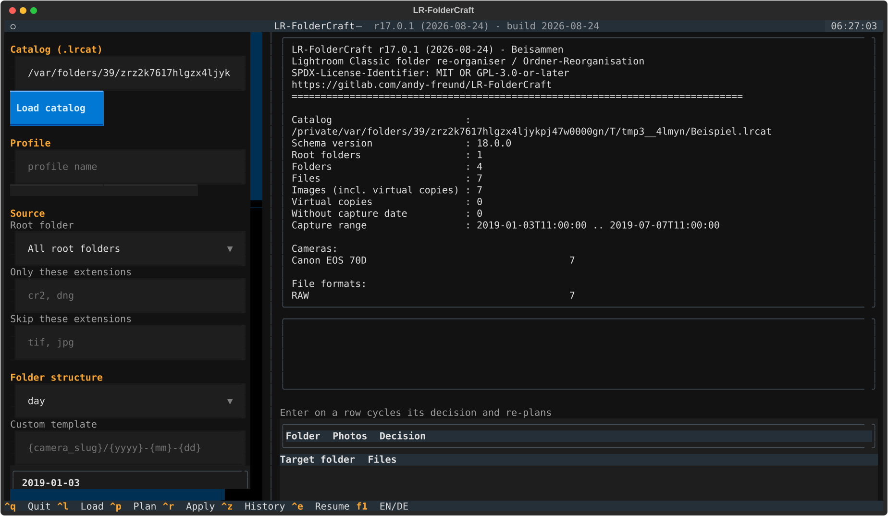

# LR-FolderCraft

**Reorganise Adobe Lightroom Classic folder trees — without losing the catalog connection.**

[](CHANGELOG.md)
[](CHANGELOG.md)
[](pyproject.toml)
[](LICENSE)

🇩🇪 **[Diese Seite auf Deutsch](README.de.md)** · 📚 [Full documentation](docs/) · [Dokumentation auf Deutsch](docs/de/)

---

## The problem

Your Lightroom library grew into a handful of year folders, each holding many
thousands of photos. You would like day folders — or camera folders, or ISO
week folders — but moving files in Finder or Explorer breaks every catalog
reference, and moving ten thousand photos inside Lightroom's Folders panel by
hand is not a plan.

## What this does

LR-FolderCraft moves the files **and** rewrites the catalog in one transaction,
so nothing is lost:

- ✅ develop settings and the full history
- ✅ virtual copies (they follow their master automatically)
- ✅ collections, keywords, flags, ratings, colour labels
- ✅ stacks, previews, smart previews
- ✅ XMP sidecar files, which travel with their photo

Only two things in the catalog ever change: new rows in `AgLibraryFolder`, and
`AgLibraryFile.folder` pointing somewhere else. Photo rows are never touched —
which is exactly why nothing about your edits can get lost.



## Quick start

```bash
git clone https://gitlab.com/andy-freund/LR-FolderCraft.git
cd LR-FolderCraft
./install/install-macos.sh              # macOS and Linux
# Windows: powershell -ExecutionPolicy Bypass -File .\install\install-windows.ps1
```

Then, **with Lightroom Classic closed**:

```bash
lrfc info  /Volumes/Photos/2019/2019.lrcat        # inspect, read only
lrfc plan  /Volumes/Photos/2019/2019.lrcat -s day # see exactly what would happen
lrfc apply /Volumes/Photos/2019/2019.lrcat -s day # do it
```

Or use the interactive interface:

```bash
lrfc tui
```

`plan` never writes anything. Read its output, then run `apply`.

## Folder structures

A structure is a list of levels; each level is a template. Twelve presets ship
with the tool:

| Preset | Result |
| --- | --- |
| `day` | `2019-01-03` |
| `year/day` | `2019/2019-01-03` |
| `year/month/day` | `2019/01/03` |
| `year/week` | `2019/W01` |
| `iso-week` | `2019-W01` |
| `camera/day` | `canon-eos-70d/2019-01-03` |
| `day/camera` | `2019-01-03/canon-eos-70d` |
| `camera/year/month/day` | `canon-eos-70d/2019/01/03` |
| `year/quarter/month` | `2019/Q1/01` |
| `year/month-name` | `2019/01 January` |

Run `lrfc presets` for the full list, `lrfc tokens` for every placeholder.

**Folders you already have** — topic folders like `Urlaub` and dated ones like
`2019-04-15 Ostern in Tirol` are recognised and, by default, dated folders keep
their name and their photos. `--interactive` asks you about each folder;
`--subfolder-action`, `--dated-folder-action` and `--folder-action ID=ACTION`
set it without being asked. See [usage.md](docs/en/usage.md).

Any combination works — separate levels with `/`:

```bash
lrfc plan CATALOG -s '{camera_slug}/{iso_year}-W{iso_week}'
lrfc plan CATALOG -s '{yyyy}/{mm} {month_name}/{dd} {weekday_short}'
```

Available placeholders include `{yyyy} {yy} {mm} {m} {dd} {d} {hh} {mi}
{month_name} {month_short} {quarter} {iso_week} {iso_year} {weekday}
{weekday_short} {doy} {camera} {camera_slug} {camera_sn} {lens} {lens_slug}
{format} {ext} {orig_folder}`.

## Safety

This tool edits your catalog database. It is built so that a failure cannot
leave you with a half-sorted library:

1. **Pre-flight checks** — Lightroom closed, write permissions, free space.
2. **Verified backup** — the catalog is copied and the copy is SHA-256 checked
   before anything else happens.
3. **Staged transaction** — all catalog changes are prepared but not committed.
4. **Journalled moves** — every file move is written to a journal, flushed and
   fsynced, *before* it is attempted.
5. **Commit last** — the catalog is only committed once every file has arrived.
6. **Automatic rollback** — if any move fails, the catalog transaction is
   discarded and the already-moved files are put back.
7. **Verification** — afterwards, every catalog path is checked against disk.

`lrfc undo JOURNAL` reverses a completed run.

Existing files are never overwritten. A name collision is resolved by renaming
(and the catalog is updated to match), or you can choose `--conflict skip`.

**Always keep an independent backup anyway.** See [docs/en/safety.md](docs/en/safety.md).

## Requirements

- Python 3.9 or newer (macOS ships with a suitable one)
- Adobe Lightroom Classic catalog, schema version 11.x–19.x
  (verified against 18.0.0 / Lightroom Classic 14)
- Lightroom Classic **closed** while the tool runs

The command line needs nothing but the standard library. The TUI adds
[Textual](https://textual.textualize.io/).

## Documentation

| | English | Deutsch |
| --- | --- | --- |
| Overview | [docs/en/index.md](docs/en/index.md) | [docs/de/index.md](docs/de/index.md) |
| Installation | [installation.md](docs/en/installation.md) | [installation.md](docs/de/installation.md) |
| Usage | [usage.md](docs/en/usage.md) | [bedienung.md](docs/de/bedienung.md) |
| Structures & tokens | [structures.md](docs/en/structures.md) | [strukturen.md](docs/de/strukturen.md) |
| How it works | [how-it-works.md](docs/en/how-it-works.md) | [funktionsweise.md](docs/de/funktionsweise.md) |
| Safety & recovery | [safety.md](docs/en/safety.md) | [sicherheit.md](docs/de/sicherheit.md) |
| Architecture | [architecture.md](docs/en/architecture.md) | [architektur.md](docs/de/architektur.md) |
| Development | [development.md](docs/en/development.md) | [entwicklung.md](docs/de/entwicklung.md) |
| Versioning | [versioning.md](docs/en/versioning.md) | [versionierung.md](docs/de/versionierung.md) |
| FAQ | [faq.md](docs/en/faq.md) | [faq.md](docs/de/faq.md) |
| Open issues | [open-issues.md](docs/en/open-issues.md) | [offene-punkte.md](docs/de/offene-punkte.md) |
| Prompts | [prompts.md](docs/en/prompts.md) | [prompts.md](docs/de/prompts.md) |

## License

Dual licensed: **MIT OR GPL-3.0-or-later**. Choose whichever fits your use.
See [LICENSE](LICENSE), [LICENSE-MIT](LICENSE-MIT), [LICENSE-GPL-3.0](LICENSE-GPL-3.0).

## Disclaimer

Provided without any warranty. Adobe, Lightroom and Lightroom Classic are
trademarks of Adobe Inc. This project is not affiliated with, endorsed by or
supported by Adobe Inc.
