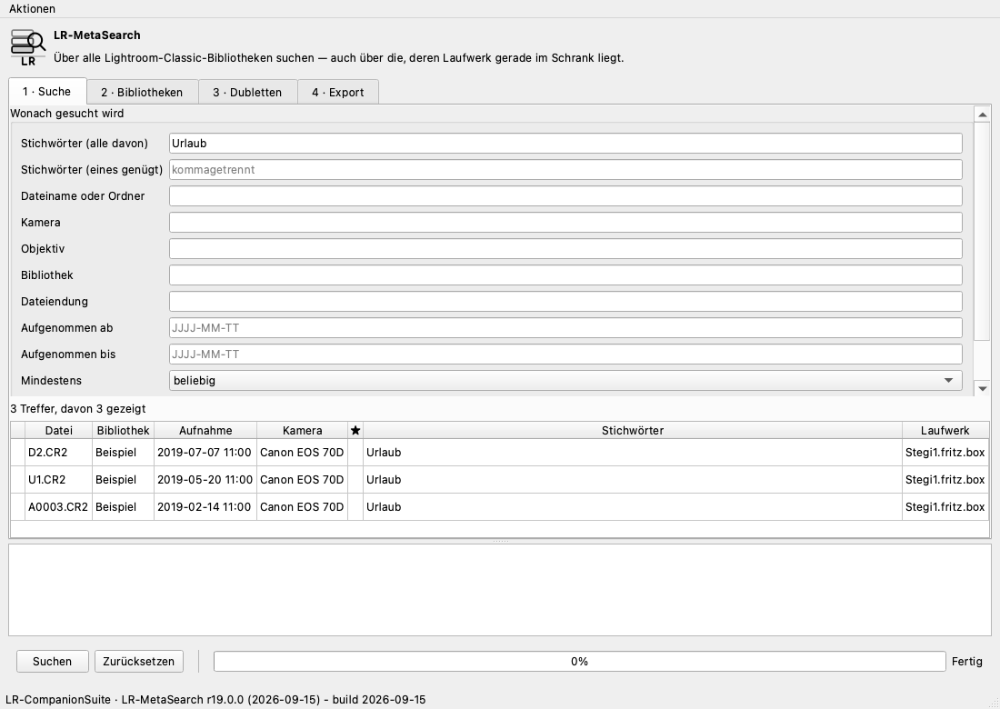

# LR-MetaSearch — der Index über alle Bibliotheken

**Revision r20.0.1 · Build-Datum 2026-09-15**

Wer über die Jahre mit mehreren Lightroom-Katalogen arbeitet, hat irgendwann
eine Frage, die keiner davon beantworten kann: *In welcher Bibliothek liegt
dieses Foto eigentlich?* Der Index beantwortet sie — auch dann, wenn das
Laufwerk gerade im Schrank liegt. Er sagt dann, **welches** Laufwerk
anzuschließen ist.

> **Der Index liest nur.** Kein Katalog wird zum Schreiben geöffnet, keine
> Bilddatei angefasst. Das Einzige, was geschrieben wird, ist die Indexdatei
> selbst — und beim Export eine *Kopie*, die das Werkzeug zuvor selbst angelegt
> hat. Ein Test prüft nach jedem Durchlauf, dass der Katalog Byte für Byte
> derselbe ist.

## In drei Befehlen

```bash
lrms --lang de scan                  # alle erreichbaren Bibliotheken einlesen
lrms --lang de status                # was der Index enthält
lrms --lang de find --keyword Hochzeit --min-rating 4
```

## `lrms scan` — einlesen

```bash
lrms scan                            # sucht in ~/Pictures und unter /Volumes
lrms scan "/Volumes/Fotos" ~/Bilder  # oder an genannten Stellen
lrms scan --index ~/mein-index.db    # eine andere Indexdatei
```

Erfasst wird je Foto: **Katalogname, Ordner, Dateiname, die im Katalog
vergebenen Stichwörter** und die **EXIF-Daten** — Kamera, Objektiv, ISO,
Brennweite, Blende, Belichtungszeit, Bildmaße, Bewertung, Farbmarkierung und,
falls vorhanden, die geografische Position.

Nichts davon erfordert, die Bilddateien zu öffnen: Lightroom hat diese Angaben
beim Import geerntet und hält sie im Katalog. Blende und Belichtungszeit stehen
dort im APEX-Maß und werden beim Einlesen in Blendenzahl und Sekunden
umgerechnet.

Ein Katalog, den Lightroom gerade geöffnet hat, wird **gemeldet und
übersprungen** statt hinter dessen Rücken gelesen. Mit `--include-locked` auch
gelesen; die Angaben können dann veraltet sein.

### Wo die Indexdatei liegt

Standardmäßig neben den Profilen im Konfigurationsverzeichnis. Mit `--index
PFAD` an jedem anderen Ort — etwa auf dem Laufwerk, zu dem er gehört, oder an
einer Stelle, die gesichert wird.

### Kopien und Sicherungen werden nicht doppelt gezählt

Das war die schwierigste Anforderung. Ein Katalog, den Lightroom beim
Versionswechsel als `…-v13-3.lrcat` neu angelegt hat, und die Fassung in einem
`_Archiv`-Ordner daneben, sind **dieselbe Bibliothek** — sie zweimal zu zählen
verdoppelt jede Antwort.

Erkannt werden sie an den **UUIDs ihrer Fotos**: Lightroom vergibt je Foto eine,
und eine Kopie trägt dieselben. Verglichen wird dabei nicht auf Gleichheit,
sondern auf **Überlappung** — eine Kopie und ihr Original laufen auseinander.
In der Sammlung, an der das entwickelt wurde, unterschieden sich zwei Fassungen
derselben Bibliothek um zwei Fotos von 3.296; ein Vergleich auf Gleichheit
hätte sie für unverwandt gehalten.

Die Stichprobe wird in **Aufnahmereihenfolge** gezogen, nicht nach UUID: Fotos,
die nach der Kopie hinzukamen, verteilen sich sonst zufällig über die
Stichprobe, und ob eine gewachsene Kopie noch erkannt wird, wäre Glückssache.

**Von einer Gruppe zählt eine, die übrigen werden vermerkt — nicht gelöscht.**
Welche die gültige ist, entscheiden Sie. Die Vermuteten stehen unter
`index status --all` mit einem `=` davor.

## `lrms status` — was drin ist

```
  47 Kataloge, 183.407 Fotos, 1.054 Stichwörter, 1 Laufwerke, 6 erkannte Kopien

Laufwerke:
  * G-DRIVE PROJECT          eindeutig    722276AB-A223-4A2C-B68C-8A5E1D7CACEA
  * gerade angeschlossen
```

**Eindeutig** heißt: Das Betriebssystem hat eine Kennung des Datenträgers
geliefert — unter macOS die `VolumeUUID`, unter Windows die Seriennummer des
Datenträgers, unter Linux die UUID des Dateisystems. Sie überlebt das
Umbenennen des Laufwerks. Steht dort **geraten**, war keine zu bekommen, und
der Index behilft sich mit einem Fingerabdruck aus Name, Dateisystem und Größe.
Das ist schwächer, und deshalb steht es da.

Der Index ist eine **Momentaufnahme**. Zu jedem Katalog steht, wann er zuletzt
gelesen wurde.

## `lrms find` — suchen

```bash
lrms find --keyword Hochzeit --keyword Berlin     # beide müssen zutreffen
lrms find --any-keyword Anna --any-keyword Ben    # eines genügt
lrms find --camera "EOS R5" --since 2024-01-01 --min-rating 3
lrms find --text IMG_0042                         # Dateiname oder Ordner
lrms find --with-gps --ext cr3 --limit 200
lrms find --keyword Hochzeit --paths              # nur Pfade, zeilenweise
```

| Kriterium | Wirkung |
| --- | --- |
| `--keyword` | mehrfach angebbar; **alle** müssen zutreffen |
| `--any-keyword` | mehrfach angebbar; **eines** genügt |
| `--text` | Dateiname oder Ordner enthält dies |
| `--camera`, `--lens` | Kamera- oder Objektivbezeichnung enthält dies |
| `--catalog` | nur Bibliotheken, deren Name dies enthält |
| `--ext` | Dateiendung, etwa `cr3` |
| `--since`, `--until` | Aufnahmedatum, `JJJJ-MM-TT`, einschließlich |
| `--min-rating` | mindestens so viele Sterne |
| `--with-gps` | nur Fotos mit Position |
| `--include-copies` | virtuelle Kopien mitzählen |

Ein `!` vor einem Treffer heißt: Das Laufwerk ist gerade nicht angeschlossen.
Der Eintrag stimmt trotzdem — er sagt Ihnen, wo zu suchen ist.

`lrms keywords` listet alle Stichwörter mit Anzahl, `--cameras` alle
Kameras.

## `lrms duplicates` — dieselbe Datei mehrfach

```bash
lrms duplicates                       # Übersicht und die ersten Gruppen
lrms duplicates --across-catalogs     # nur, was über Bibliotheken geht
lrms duplicates --near                # Serien und Belichtungsreihen
```

Zwei Fragen, die sich ähneln und nicht dasselbe sind:

**Gleichheit** ist aus den Katalogen allein zu beantworten: Aufnahmezeit,
Kamera, Dateiname und Bildmaße ergeben zusammen einen belastbaren Schlüssel.
Jedes einzelne Merkmal wiederholt sich in einer Bibliothek, alle vier zusammen
nicht — es sei denn, es ist wirklich dasselbe Foto. Das funktioniert bei
abgestecktem Laufwerk.

**Nähe** — eine Serie, eine Belichtungsreihe, RAW neben JPEG — ist ebenfalls aus
dem Katalog zu beantworten, weil sich solche Aufnahmen in Merkmalen
unterscheiden, die er festhält.

**Was hier nicht ist: visuelle Ähnlichkeit.** Zwei verschiedene Aufnahmen daran
zu unterscheiden, *was* sie zeigen, braucht die Bildpunkte, und die eines
RAW-Formats zu lesen braucht einen Decoder, den dieses Werkzeug nicht
mitbringt. Lieber die Grenze nennen, als eine schwache Fassung unter einem
Namen anbieten, der mehr verspricht.

Virtuelle Kopien werden **nicht** als Dubletten gezählt — sie teilen sich ihre
Datei mit dem Original, und sonst wäre jede Bearbeitung eine Dublette.

Der Befehl **ändert nichts**. Er ist ein Bericht.

## `lrms export` — aus der Suche ein Katalog

```bash
lrms export --keyword "Best of" --min-rating 4 --to ~/Desktop/Auswahl
```

Der naheliegende Weg wäre, einen Katalog zu schreiben. Das hieße,
Entwicklungseinstellungen, Sammlungen, Stapel und Vorschauen nachzubauen — und
etwas davon falsch zu machen ergäbe einen Katalog, der sich öffnen lässt und
unbemerkt falsch ist. Das ist das schlechteste erreichbare Ergebnis.

Deshalb geht es andersherum: Jede beteiligte Bibliothek wird **kopiert**, und
aus der Kopie wird entfernt, was nicht gewählt war. Was übrig bleibt, hat
Lightroom selbst geschrieben und ist damit richtig — Entwicklungseinstellungen,
Stichwörter, Sammlungen, Bewertungen, alles.

```
  Auswahl.lrcat                      20 von 6.043  (10,5 MB)

Jeden in Lightroom öffnen und über Datei > Aus anderem Katalog importieren
in den gewünschten Katalog zusammenführen.
```

### Was mitkopiert wird — und warum es so groß ist

Lightroom Classic 11 und neuer legt neben jedem Katalog ein **Verzeichnis**
`<Name>.lrcat-data` ab. Darin steht ein Schlüssel-Wert-Speicher aus `.blob`-
und `.sst`-Dateien; unter anderem die Maskendaten. Es gehört zum Katalog: Fehlt
es, verweigert Lightroom mit *„<Name>.lrcat-data konnte nicht geöffnet
werden"*.

Deshalb wandert es mit. Zwei Dinge sollten Sie dazu wissen:

- **Es lässt sich nicht verkleinern.** Der Speicher ist nach Dingen
  geschlüsselt, über die dieses Werkzeug nichts weiß; daran zu raten hieße, den
  Katalog still zu beschädigen. Also kommt er ganz mit oder gar nicht.
- **Er ist oft ein Vielfaches des Katalogs.** In der Bibliothek, an der das
  auffiel: 492 MB neben 75 MB Katalog. Ein Export von sieben Fotos wird so zu
  einem halben Gigabyte. Der Befehl nennt die Größe, bevor er kopiert.

Mit `--without-data` bleibt es weg. Der verkleinerte Katalog öffnet dann
trotzdem — aber die dort abgelegte Arbeit ist nicht darin. Das ist eine
bewusste Entscheidung, keine Voreinstellung.

Das Zusammenführen über Bibliotheken hinweg macht Lightroom mit **Datei → Aus
anderem Katalog importieren**. Das kann es gut, und es ist nicht Aufgabe dieses
Werkzeugs, das nachzubauen.

Beachten Sie:

- Das Original wird nur gelesen. Die Kopie entsteht mit ihrem
  Write-Ahead-Log, damit auch das mitkommt, was Lightroom zuletzt getan hat.
- Eine virtuelle Kopie zieht ihr Original mit — ohne dieses kann sie nicht
  bestehen.
- Der Zielordner muss leer sein.
- Das `.lrcat-data`-Verzeichnis kommt mit; siehe oben.
- Die **Bilddateien werden nicht mitkopiert.** Der reduzierte Katalog verweist
  auf dieselben Dateien wie zuvor. Wer die Fotos mitnehmen will, benutzt in
  Lightroom beim Importieren die Option, sie zu kopieren.

## Das Fenster

```bash
lrms gui            # oder über den Startbildschirm: lrcs
lrms --lang de gui
```



Vier Reiter, einer je Arbeitsschritt: **Suche**, **Bibliotheken** (Laufwerke
und Kataloge, mit dem Hinweis, was gerade angeschlossen ist), **Dubletten** und
**Export**. Das Protokoll liegt unter den Reitern, weil dort die Fehler
erscheinen — und ein Fehler hinter einem Reiter ist ein Fehler, den niemand
sieht. Dieselbe Lehre wie beim Ordnerfenster in r18.

Lange Arbeiten laufen in eigenen Threads, das Fenster bleibt also bedienbar,
während 47 Bibliotheken eingelesen werden.

## Grenzen

| | |
| --- | --- |
| Der Index ist eine Momentaufnahme | Nach Änderungen an einer Bibliothek erneut einlesen |
| Visuelle Ähnlichkeit | Nicht enthalten, siehe oben |
| Windows-Laufwerkskennung | Umgesetzt, aber **nicht an einem Windows-Rechner erprobt** |
| Oberfläche | Vorerst nur die Kommandozeile; Fenster und Terminaloberfläche stehen aus |

## Siehe auch

- [13-offene-punkte.md](13-offene-punkte.md) — O-27 bis O-30, wie es dazu kam
- [06-sicherheit.md](06-sicherheit.md) — warum das Werkzeug Kataloge so behandelt, wie es sie behandelt
- [04-bedienung.md](04-bedienung.md) — die Ordnerumsortierung, das ältere und größere Teil des Werkzeugs
