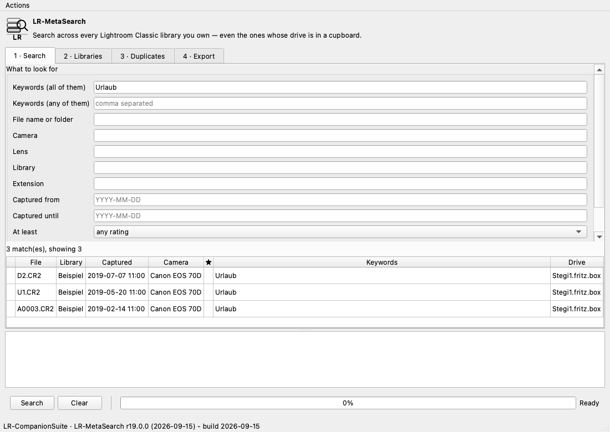

# LR-MetaSearch — the index across every library

**Revision r20.0.3 · Build date 2026-09-15**

Anyone who has worked with several Lightroom catalogs over the years ends up
with a question none of them can answer: *which library is this photograph
actually in?* The index answers it — even with the drive in a cupboard. It then
tells you **which** drive to connect.

> **The index only reads.** No catalog is opened for writing, no image file is
> touched. The only thing written is the index file itself — and, on export, a
> *copy* the tool made first. A test compares the catalog's bytes before and
> after every scan.

## In three commands

```bash
lrms scan                            # read every library it can reach
lrms status                          # what the index holds
lrms find --keyword Wedding --min-rating 4
```

## `lrms scan` — reading libraries in

```bash
lrms scan                            # looks in ~/Pictures and under /Volumes
lrms scan "/Volumes/Photos" ~/Pictures   # or in the places you name
lrms scan --index ~/my-index.db      # a different index file
```

Recorded per photograph: **catalog name, folder, file name, the keywords
assigned in the catalog** and the **EXIF data** — camera, lens, ISO, focal
length, aperture, shutter speed, pixel dimensions, rating, colour label and,
where there is one, the geographic position.

None of it requires opening an image file: Lightroom harvested these when the
photographs were imported and keeps them in the catalog. Aperture and shutter
speed are stored there in APEX and are converted to f-numbers and seconds as
they are read.

A catalog Lightroom currently has open is **reported and skipped** rather than
read behind its back. With `--include-locked` it is read anyway; what comes out
may then be out of date.

### Where the index file lives

Beside the profiles in the configuration directory by default. `--index PATH`
puts it anywhere else — on the drive it belongs to, say, or somewhere that gets
backed up.

### Copies and backups are not counted twice

This was the hardest requirement. A catalog Lightroom rewrote as
`…-v13-3.lrcat` during a version upgrade, and the version sitting in an
`_Archive` folder beside it, are **the same library** — counting both doubles
every answer.

They are recognised by the **UUIDs of their photographs**: Lightroom gives each
photograph one, and a copy carries the same ones. The comparison is not for
equality but for **overlap** — a copy and its original drift apart. In the
collection this was developed against, two versions of one library differed by
two photographs out of 3,296; asking whether they were identical would have
called them unrelated.

The sample is drawn in **insertion order**, not UUID order: photographs added
after the copy was taken otherwise scatter randomly through the sample, and
whether a grown copy is still recognised comes down to luck.

**One of a group counts; the others are recorded, not deleted.** Which one is
the valid one is your decision. The ones judged to be copies appear under
`index status --all` with a `=` in front.

## `lrms status` — what is in it

```
  47 catalogs, 183,407 photographs, 1,054 keywords, 1 drives, 6 known copies

Drives:
  * G-DRIVE PROJECT          certain      722276AB-A223-4A2C-B68C-8A5E1D7CACEA
  * attached right now
```

**Certain** means the operating system gave up an identifier for the volume —
on macOS the `VolumeUUID`, on Windows the volume serial number, on Linux the
filesystem UUID. It survives renaming the drive. Where it says **guessed**,
none was to be had, and the index falls back to a fingerprint of name,
filesystem and size. That is weaker, which is why it says so.

The index is a **snapshot**. Each catalog carries the moment it was last read.

## `lrms find` — searching

```bash
lrms find --keyword Wedding --keyword Berlin      # both must apply
lrms find --any-keyword Anna --any-keyword Ben    # one is enough
lrms find --camera "EOS R5" --since 2024-01-01 --min-rating 3
lrms find --text IMG_0042                         # file name or folder
lrms find --with-gps --ext cr3 --limit 200
lrms find --keyword Wedding --paths               # paths only, one per line
```

| Criterion | What it does |
| --- | --- |
| `--keyword` | repeatable; **all** must apply |
| `--any-keyword` | repeatable; **one** is enough |
| `--text` | file name or folder contains this |
| `--camera`, `--lens` | camera or lens name contains this |
| `--catalog` | only libraries whose name contains this |
| `--ext` | file extension, e.g. `cr3` |
| `--since`, `--until` | capture date, `YYYY-MM-DD`, inclusive |
| `--min-rating` | at least this many stars |
| `--with-gps` | only photographs with a position |
| `--include-copies` | count virtual copies too |

A `!` in front of a hit means the drive is not attached at the moment. The
entry is still right — it tells you where to look.

`lrms keywords` lists every keyword with its count, `--cameras` every
camera.

## `lrms duplicates` — the same file more than once

```bash
lrms duplicates                       # the totals and the first groups
lrms duplicates --across-catalogs     # only what spans libraries
lrms duplicates --near                # bursts and brackets
```

Two questions that look alike and are not:

**Sameness** is answerable from the catalogs alone: capture time, camera, file
name and pixel dimensions together. Any one of them repeats within a library;
all four together do not, unless it really is the same photograph. It works
with the drive disconnected.

**Nearness** — a burst, a bracket, a raw beside its JPEG — is also answerable
from the catalog, because such photographs differ in ways it records.

**What is not here is visual similarity.** Telling two different frames apart
by what they show needs the pixels, and reading the pixels of a raw file needs
a decoder this tool does not ship. Better to state the limit than to offer a
weak version of it under a name that promises more.

Virtual copies are **not** counted as duplicates — they share their file with
their master, and otherwise every edit would be a duplicate.

The command **changes nothing**. It is a report.

## `lrms export` — a catalog out of a search

```bash
lrms export --keyword "Best of" --min-rating 4 --to ~/Desktop/Selection
```

The obvious way would be to write a catalog. That would mean recreating develop
settings, collections, stacks and previews — and getting any of it wrong
produces a catalog that opens and is quietly wrong, which is the worst outcome
available.

So it goes the other way round. Every library involved is **copied**, and from
the copy everything not selected is removed. What survives was written by
Lightroom itself and is therefore right: develop settings, keywords,
collections, ratings, all of it.

```
  Selection.lrcat                    20 of 6,043  (10.5 MB)

Open each in Lightroom, then use File > Import from Another Catalog to merge
them into the catalog you want.
```

### When the catalog names a drive that is gone

A catalog remembers where its photographs are as an **absolute path**. Rename a
drive or move the library and the catalog does not notice: it goes on naming a
volume that no longer exists. On its own machine that is a nuisance; in a
reduced export it is a dead end, because Lightroom opens the catalog and finds
nothing.

So the export checks, and puts it right -- but **only with proof**. It looks in
the source catalog's own directory and a few above it, trying each tail of the
stated path against them. A candidate counts only once **six photographs from
the catalog are really there**. Guessing about where somebody's photographs are
is not something this tool does.

```
Photographs are not at /Volumes/Foto_extern/Andy/shootings/ any more;
pointed at /Volumes/G-DRIVE PROJECT/lr-andy/Andy/shootings/
```

`--no-relink` keeps whatever the original says.

The same applies to searching: a `!` before a hit means the file is **not where
the catalog says** -- the drive may be detached, or the library was moved
without telling Lightroom. What is checked is the photographs' folder, not the
catalog's drive: those are not the same place.

### What comes along — and why it is so large

Lightroom Classic 11 and later keeps a **directory** called
`<name>.lrcat-data` beside every catalog. Inside is a key-value store of
`.blob` and `.sst` files; masking data among them. It belongs to the catalog:
without it Lightroom refuses with *"<name>.lrcat-data could not be opened"*.

So it travels with the copy. Two things worth knowing:

- **It cannot be reduced.** The store is keyed by things this tool knows
  nothing about, and guessing would mean quietly damaging the catalog. So it
  comes whole or not at all.
- **It is often several times the size of the catalog.** In the library where
  this came to light: 492 MB beside a 75 MB catalog. An export of seven
  photographs becomes half a gigabyte. The command says how large before it
  copies.

`--without-data` leaves it behind. The reduced catalog still opens — but the
work held in there is not in it. That is a decision to take deliberately, not
a default.

> **Proven in Lightroom.** On 15 September 2026 a catalog made this way was
> opened in Lightroom Classic: the chosen photographs, with their develop
> settings.

Merging across libraries is Lightroom's **File → Import from Another Catalog**.
It does that well, and it is not this tool's business to reimplement it.

Note:

- The original is only read. The copy is taken together with its write-ahead
  log, so whatever Lightroom did last comes along.
- A virtual copy brings its master with it — it cannot exist without one.
- The target directory has to be empty.
- The `.lrcat-data` directory comes along; see above.
- The **image files are not copied.** The reduced catalog points at the same
  files as before. To take the photographs along, use Lightroom's option to
  copy them while importing.

## The window

```bash
lrms gui            # or through the launcher: lrcs
```



Four tabs, one per step of the work: **Search**, **Libraries** (drives and
catalogs, saying which are attached), **Duplicates** and **Export**. The log
sits below the tabs because that is where errors appear — and an error behind a
tab is an error nobody sees. The same lesson the folder window learned in r18.

Long jobs run on worker threads, so the window stays usable while 47 libraries
are read in.

## Limits

| | |
| --- | --- |
| The index is a snapshot | Scan again after a library changes |
| Visual similarity | Not included, see above |
| Windows drive identity | Implemented, but **not tried on a Windows machine** |
| Interface | The command line for now; the window and the terminal interface are still to come |

## See also

- [13-open-issues.md](13-open-issues.md) — O-27 to O-30, and how this came about
- [06-safety.md](06-safety.md) — why the tool treats catalogs the way it does
- [04-usage.md](04-usage.md) — the folder reorganisation, the older and larger half of the tool
