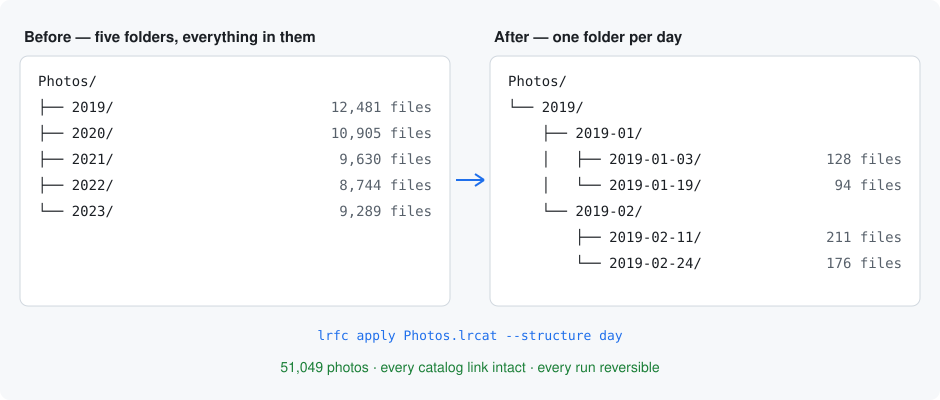
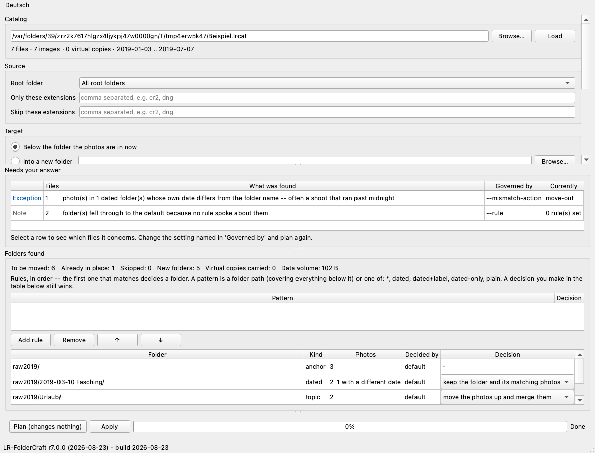
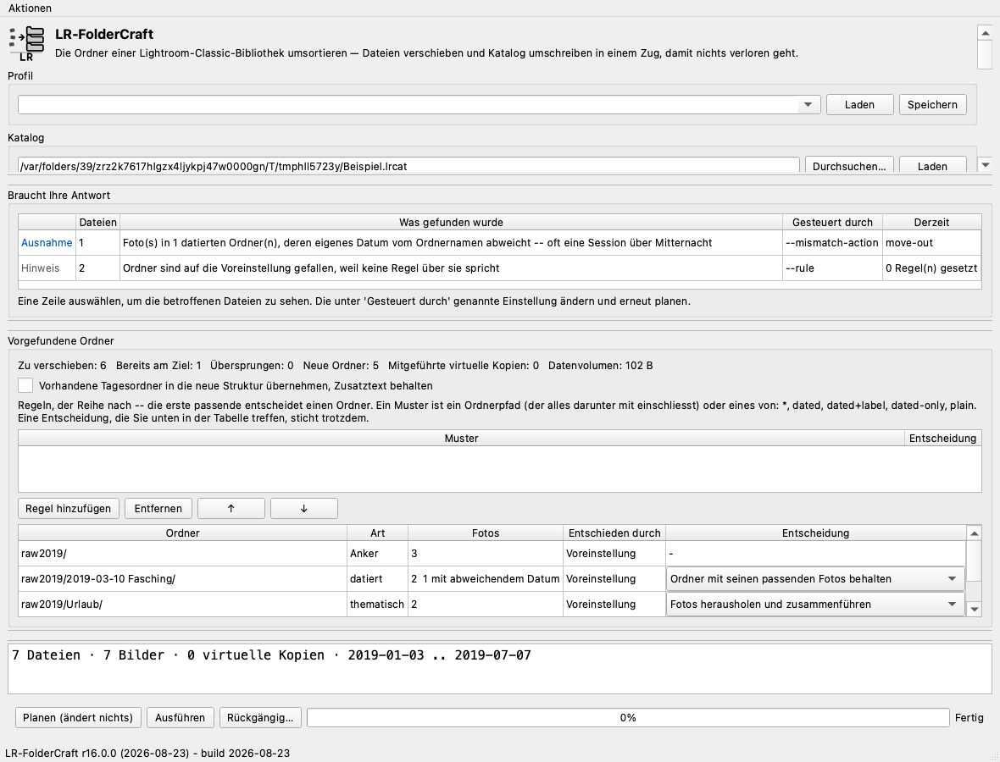

---
hide:
  - navigation
---

# Two tools that sit beside Adobe Lightroom Classic

<p align="center">
  
</p>

**LR-CompanionSuite** is free, open source, and has no account, no telemetry and
no cost. It holds two tools:

| | | |
| :---: | --- | --- |
|  | **LR-FolderCraft** · `lrfc` | Reorganise the folder tree — files and catalog together, so nothing is lost and every run can be taken back. |
|  | **LR-MetaSearch** · `lrms` | Search across every library you own, find what is held twice, and build catalogs out of a selection. Reads only. |

`lrcs` opens a launcher offering both.

[Install them](en/02-installation.md) ·
[Read the safety story](en/06-safety.md) ·
[Source code](https://gitlab.com/andy-freund/LR-CompanionSuite)

---

# Move Lightroom Classic folders without losing the catalog connection

<p align="center">
  
</p>

**LR-FolderCraft** rebuilds the folder tree of an Adobe Lightroom Classic
library on disk **and** in the catalog, in one operation, so that not a single
photo turns up missing afterwards.

Free, open source, no account, no telemetry, no cost.
[Install it](en/02-installation.md) · [Read the safety story](en/06-safety.md) ·
[Source code](https://gitlab.com/andy-freund/LR-CompanionSuite)

🇩🇪 **[Diese Seite auf Deutsch](#lightroom-ordner-verschieben-ohne-die-katalogverknüpfung-zu-verlieren)**

---

<picture>
  <source media="(prefers-color-scheme: dark)" srcset="images/before-after-en-dark.svg">
  
</picture>

## The problem you probably arrived with

Your Lightroom library grew into a handful of huge year folders. You would
like a proper structure — by year, month and day, by camera, by ISO week —
but every obvious way to get there is a trap:

- **Moving folders in Finder or Windows Explorer** breaks the catalog. Lightroom
  shows question marks on the folders and *"the file named … is offline or
  missing"* on the photos, and reconnecting thousands of them by hand is not a
  weekend project.
- **Dragging folders inside Lightroom's own Folders panel** does keep the
  catalog intact, but it moves one folder at a time, it is slow on tens of
  thousands of files, and a crash halfway through leaves you nowhere.
- **Re-importing** loses your develop settings, collections, flags, keywords
  and history. It is not an option.

## What LR-FolderCraft does instead

It reads the catalog, works out where every photo *should* live under the
structure you choose, then moves the files and rewrites the catalog's folder
records to match — as one operation, on tens of thousands of photos, in
minutes.

```bash
lrfc plan  ~/Pictures/Photos.lrcat --structure day      # see it first, nothing is touched
lrfc apply ~/Pictures/Photos.lrcat --structure day      # then do it
lrfc undo  .../journal.jsonl                            # and take it back if you want to
```

Or in a window, if you prefer one:



## Why you can trust it with your library

This is the part that matters, and it is why the tool exists at all.

- **The dry run is the default.** `plan` writes nothing, anywhere. You read the
  whole plan before anything happens.
- **The catalog is backed up** before it is touched, and the backup is verified.
- **The catalog is written last.** Files move first and every move is written
  to a journal as it happens. If the machine dies mid-run, the catalog is
  untouched — and `lrfc resume` puts the files back or carries the run to the
  end, whichever you want.
- **Every run can be undone.** The journal is the record of what actually
  happened, so undo is exact, not a guess. Records, logs and a copy of the
  settings are stored next to the catalog they belong to.
- **It was proven at scale before it was published**: a real 51,049-photo,
  2.36 TB library, migrated and reversed many times, verified byte-identical
  each time across ten catalog tables, all 51,049 paths and every file on disk.
- **The catalog is opened read-only** while planning, and Lightroom must be
  closed — the tool refuses to start otherwise.

## What it can do

- Structures by **year / month / day**, ISO week, camera, lens, ISO, file type,
  or your own template — cumulative date levels (`2019 / 2019-01 / 2019-01-03`)
  included.
- **Rules per folder**: keep a themed folder as it is, move it unchanged to the
  new location, file it into the structure, sort only what is inside it.
- Folders already named `2019-01-03 Wedding` can be **filed into the new
  structure with their extra text preserved**.
- **Sidecar files** (`.xmp`), virtual copies, stacks and raw+JPEG pairs are
  handled together.
- Files on disk that the catalog does not know about are collected into one
  clearly named folder rather than left scattered.
- **Three front ends** — command line, terminal interface, and a window —
  all with the same abilities, in **English and German**.

---

## LR-MetaSearch — search across every library


```bash
lrms scan                                   # read your libraries into an index
lrms find --keyword Wedding --min-rating 4  # search across all of them
lrms duplicates                             # what is held more than once
```

Against the collection it was built on: **47 libraries, 183,407 photographs,
read in 26 seconds**, without opening a single image file. It answers with the
drive in a cupboard, and then tells you which drive to connect.

[**Read more →**](en/15-index.md)

## Requirements and limits

| | |
| --- | --- |
| Works with | **Adobe Lightroom Classic** (the catalog-based one) |
| Does **not** work with | Lightroom CC / the cloud-based Lightroom, which has no folder tree to rebuild |
| Runs on | macOS and Windows, Python 3.9 or newer |
| Licence | MIT **or** GPL-3.0-or-later — your choice |

[**Install it →**](en/02-installation.md) [**Full documentation →**](en/01-index.md)

---
---

# Zwei Werkzeuge, die neben Adobe Lightroom Classic stehen

**LR-CompanionSuite** ist frei, quelloffen, ohne Konto, ohne Telemetrie,
kostenlos. Sie enthält zwei Werkzeuge:

| | | |
| :---: | --- | --- |
|  | **LR-FolderCraft** · `lrfc` | Den Ordnerbaum umsortieren — Dateien und Katalog in einem Zug, sodass nichts verloren geht und jeder Lauf zurücknehmbar ist. |
|  | **LR-MetaSearch** · `lrms` | Über alle Bibliotheken suchen, Doppeltes finden und aus einer Auswahl Kataloge bauen. Liest nur. |

`lrcs` öffnet einen Startbildschirm, der beide anbietet.

[Installieren](de/02-installation.md) ·
[Wie sicher das ist](de/06-sicherheit.md) ·
[Quelltext](https://gitlab.com/andy-freund/LR-CompanionSuite)

---

# Lightroom-Ordner verschieben, ohne die Katalogverknüpfung zu verlieren

**LR-FolderCraft** baut den Ordnerbaum einer Adobe-Lightroom-Classic-Bibliothek
neu auf — auf der Festplatte **und** im Katalog, in einem Zug, sodass hinterher
kein einziges Foto als fehlend auftaucht.

Frei, quelloffen, ohne Konto, ohne Telemetrie, kostenlos.
[Installieren](de/02-installation.md) · [Wie sicher das ist](de/06-sicherheit.md) ·
[Quelltext](https://gitlab.com/andy-freund/LR-CompanionSuite)

<picture>
  <source media="(prefers-color-scheme: dark)" srcset="images/before-after-de-dark.svg">
  
</picture>

## Das Problem, mit dem Sie vermutlich hier sind

Ihre Lightroom-Bibliothek ist in eine Handvoll riesiger Jahresordner
hineingewachsen. Sie hätten gern eine ordentliche Struktur — nach Jahr, Monat
und Tag, nach Kamera, nach Kalenderwoche — aber jeder naheliegende Weg dorthin
ist eine Falle:

- **Ordner im Finder oder Explorer verschieben** zerreißt den Katalog.
  Lightroom zeigt Fragezeichen auf den Ordnern und *„Die Datei … ist offline
  oder fehlt"* auf den Fotos. Tausende davon von Hand wieder zu verknüpfen ist
  kein Wochenendprojekt.
- **Ordner in Lightrooms eigenem Ordner-Bedienfeld ziehen** hält den Katalog
  zwar heil, bewegt aber immer nur einen Ordner, ist bei Zehntausenden Dateien
  quälend langsam, und ein Absturz mittendrin lässt Sie im Nirgendwo stehen.
- **Neu importieren** verliert Entwicklungseinstellungen, Sammlungen,
  Markierungen, Stichwörter und Verlauf. Das kommt nicht infrage.

## Was LR-FolderCraft stattdessen tut

Es liest den Katalog, ermittelt für jedes Foto den Ort, an den es nach der von
Ihnen gewählten Struktur gehört, verschiebt dann die Dateien und schreibt die
Ordnereinträge des Katalogs passend um — als einen Vorgang, über Zehntausende
Fotos, in Minuten.

```bash
lrfc --lang de plan  ~/Bilder/Fotos.lrcat --structure day   # erst ansehen, nichts wird angefasst
lrfc --lang de apply ~/Bilder/Fotos.lrcat --structure day   # dann ausführen
lrfc --lang de undo  .../journal.jsonl                      # und zurücknehmen, wenn Sie mögen
```

Oder in einem Fenster, wenn Ihnen das lieber ist:



## Warum Sie ihm Ihre Bibliothek anvertrauen können

Das ist der Punkt, auf den es ankommt — und der Grund, warum es das Werkzeug
überhaupt gibt.

- **Der Probelauf ist der Normalfall.** `plan` schreibt nirgendwo etwas. Sie
  lesen den vollständigen Plan, bevor irgendetwas geschieht.
- **Der Katalog wird gesichert**, bevor er angefasst wird, und die Sicherung
  wird geprüft.
- **Der Katalog wird zuletzt geschrieben.** Erst wandern die Dateien, und jede
  Verschiebung wird sofort in ein Journal geschrieben. Stirbt die Maschine
  mittendrin, ist der Katalog unberührt — und `lrfc resume` stellt die Dateien
  zurück oder führt den Lauf zu Ende, wie Sie möchten.
- **Jeder Lauf lässt sich rückgängig machen.** Das Journal hält fest, was
  tatsächlich geschah; die Rücknahme ist damit exakt und keine Vermutung.
  Aufzeichnungen, Protokolle und eine Kopie der Einstellungen liegen neben dem
  Katalog, zu dem sie gehören.
- **Es wurde in echter Größe belegt, bevor es veröffentlicht wurde**: eine
  reale Bibliothek mit 51.049 Fotos und 2,36 TB, viele Male umgestellt und
  zurückgenommen, jedes Mal byte-identisch geprüft — über zehn Katalogtabellen,
  alle 51.049 Pfade und jede Datei auf der Platte.
- **Der Katalog wird zum Planen nur lesend geöffnet**, und Lightroom muss
  geschlossen sein — sonst startet das Werkzeug gar nicht erst.

## Was es kann

- Strukturen nach **Jahr / Monat / Tag**, Kalenderwoche, Kamera, Objektiv, ISO,
  Dateityp oder eigener Vorlage — kumulative Datumsebenen
  (`2019 / 2019-01 / 2019-01-03`) eingeschlossen.
- **Regeln je Ordner**: einen thematischen Ordner so lassen, wie er ist, ihn
  unverändert an den neuen Ort verschieben, ihn in die Struktur einreihen oder
  nur seinen Inhalt sortieren.
- Ordner, die bereits `2019-01-03 Hochzeit` heißen, lassen sich **mit ihrem
  Zusatztext in die neue Struktur einreihen**.
- **Beipackdateien** (`.xmp`), virtuelle Kopien, Stapel und RAW+JPEG-Paare
  werden zusammen behandelt.
- Dateien auf der Platte, die der Katalog nicht kennt, wandern in einen
  eindeutig benannten Ordner, statt verstreut liegen zu bleiben.
- **Drei Oberflächen** — Kommandozeile, Terminaloberfläche und Fenster — alle
  mit demselben Funktionsumfang, auf **Deutsch und Englisch**.

---

## LR-MetaSearch — über alle Bibliotheken suchen


```bash
lrms --lang de scan                              # Bibliotheken einlesen
lrms --lang de find --keyword Hochzeit --min-rating 4
lrms --lang de duplicates                        # was mehrfach vorhanden ist
```

An der Sammlung, an der es entstand: **47 Bibliotheken, 183.407 Fotos, in 26
Sekunden eingelesen**, ohne eine einzige Bilddatei zu öffnen. Es antwortet auch
bei abgestecktem Laufwerk — und sagt dann, welches anzuschließen ist.

[**Mehr dazu →**](de/15-bibliotheksindex.md)

## Voraussetzungen und Grenzen

| | |
| --- | --- |
| Arbeitet mit | **Adobe Lightroom Classic** (der katalogbasierten Fassung) |
| Arbeitet **nicht** mit | Lightroom CC / dem Cloud-Lightroom, das keinen Ordnerbaum hat, den man umbauen könnte |
| Läuft auf | macOS und Windows, Python 3.9 oder neuer |
| Lizenz | MIT **oder** GPL-3.0-or-later — Sie wählen |

[**Installieren →**](de/02-installation.md) [**Vollständige Dokumentation →**](de/01-index.md)
