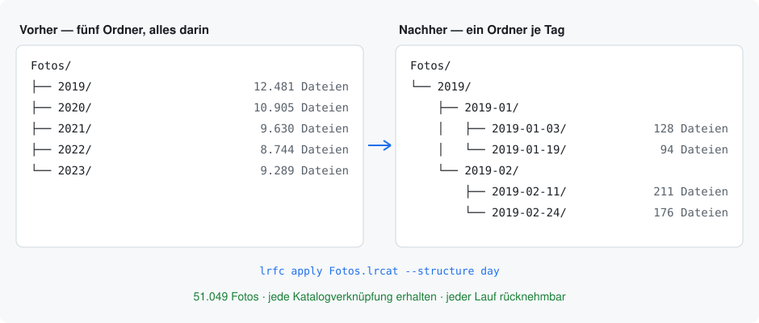

# Für Andreas — Stand der Bekanntmachung

> **Nachtrag 15.09.2026:** Das Projekt heißt jetzt **LR-CompanionSuite** und
> enthält zwei Werkzeuge. Alle Adressen unten sind auf den neuen Namen
> gezogen. Das alte GitLab-Repository steht unangetastet weiter; das neue ist
> ein eigenes Projekt. Die Aufgaben in „Was bei dir bleibt" gelten unverändert
> — nur eben für die Suite.

*24.08.2026, nach r20.0.0. Was aufgesetzt ist, was es kann, und was bei dir
liegen bleibt. Zum Nachschlagen, wenn du das Thema wieder aufnimmst.*

---

## 1. Auffindbarkeit

**Die Website ist live:** <https://andy-freund.gitlab.io/LR-CompanionSuite>

Die Startseite ist neu und zweisprachig, geschrieben in den Worten, die gesucht
werden — „Lightroom-Ordner verschieben, ohne die Katalogverknüpfung zu
verlieren". Sie führt mit dem Problem, dann mit dem Grund zu vertrauen, und
erst danach mit dem Funktionsumfang. Die Doku dahinter ist keine zweite Kopie,
sondern eine Ansicht auf `docs/`, kann also nicht auseinanderlaufen.

Pages stand auf „nur Projektmitglieder" — von außen kam ein Anmeldefenster.
Ist offen. Ebenso stand die Adresse auf einer Zufallsdomain; jetzt die lesbare.

**GitLab:** zwölf Schlagworte gesetzt (waren keine), Beschreibung geschärft.

**GitHub-Spiegel:** <https://github.com/westfreund/LR-CompanionSuite> — öffentlich,
vollständige Historie mit 44 Tags, dieselben Schlagworte, Release r20.0.0
veröffentlicht. Beide READMEs sagen jetzt, dass GitLab das Zuhause ist und
Tickets dorthin gehören. Wie die beiden synchron bleiben, steht in
[../docs/de/11-versionierung.md](../docs/de/11-versionierung.md) im
Veröffentlichungsablauf.

### Zwei Funde nebenbei

Der Website-Bau hat zwei Mängel in der Doku aufgedeckt, die keinem Test
aufgefallen wären: vier Verweise zeigten aus dem Dokumentenbaum hinaus, und ein
deutscher Anker löste nicht auf, weil der Standard-Slug Umlaute wegwirft,
GitLab sie aber behält. Beides behoben — und beides jetzt durch Tests
abgesichert.

**Und ein größerer:** die CI-Pipeline war seit r16.1.0 rot. Der Test, der prüft,
ob jeder Tag im Changelog steht, fragt `git` — und die schlanken Container haben
kein `git`. Fünf Jobs scheiterten aus einem Grund, der mit der Doku nichts zu
tun hatte, und zwei Releases gingen trotzdem raus, weil niemand hingesehen hat.
Behoben, und die Prüfung läuft jetzt in einem eigenen Job wirklich.

## 2. Das Bild

Steht jetzt ganz oben in beiden READMEs und auf der Startseite. Erzeugt, nicht
gezeichnet ([../scripts/make_diagram.py](../scripts/make_diagram.py)) — beide
Sprachen aus einer Quelle. Die erste Fassung nutzte CSS-Variablen und kam als
schwarzes Rechteck zurück; jetzt zwei feste Farbfassungen wie beim Logo.

## 3. Texte und Anschreiben

In diesem Ordner, damit sie nicht im Chat verloren gehen:

| | |
|---|---|
| [posts-en.md](posts-en.md) | Lightroom Queen, Adobe Community, Reddit, Show HN |
| [posts-de.md](posts-de.md) | DSLR-Forum, fotocommunity, Kommentarvorlage |
| [letters.md](letters.md) | fotoespresso, Victoria Bampton, DOCMA / c't |
| [faq-for-sceptics.md](faq-for-sceptics.md) | die Rückfragen, die kommen werden |
| [screencast.md](screencast.md) | Drehbuch für die sechzig Sekunden |

Jeder Entwurf legt in den ersten Zeilen offen, dass er von dir ist, und nennt
die Grenzen. Ohne das ist der Rest wertlos.

## 4. Fürs Video

[../scripts/make_demo_catalog.py](../scripts/make_demo_catalog.py) baut eine
Wegwerf-Bibliothek mit allem, was sich zeigen lässt — thematischer Ordner,
Sessionordner mit Zusatztext, ein Foto mit abweichendem Datum, damit die
Ausnahmen-Tabelle nicht leer ist. Getestet: `plan` läuft sauber durch. Du musst
nicht auf echten Fotos aufnehmen.

## Was bei dir bleibt

- **Linkvorschau bei GitHub setzen.** Das Repository-Bild bei GitLab steht.
  GitHub kennt für ein Repository kein solches Bild — es zeigt das Bild des
  Kontos. Was es gibt, ist die Linkvorschau: **Settings → General → Social
  preview → Edit**, und dort
  [`docs/images/brand/social-1280x640.png`](../docs/images/brand/social-1280x640.png)
  hochladen. Nur über die Weboberfläche möglich, es gibt keine Schnittstelle
  dafür.
- **Wenn das Konto selbst noch kein Bild hat:** dasselbe für das GitHub-Profil,
  mit [`avatar-512.png`](../docs/images/brand/avatar-512.png). Das ist es, was
  neben dem Repository-Namen erscheint.
- **Das Video aufnehmen.** Das Drehbuch steht, die Demo-Bibliothek auch.
- **Posten — einer pro Woche, nicht alle am selben Tag.** Und vorher die Regeln
  des jeweiligen Forums zur Eigenwerbung lesen: die ändern sich, und der Stand
  von August 2026 ist nicht ewig gültig. Deshalb stehen sie bewusst nicht in
  den Entwürfen.
- **AlternativeTo und die awesome-Listen** — braucht deine Konten.

Der wirksamste erste Schritt ist nicht ein Beitrag, sondern ein paar Wochen
echtes Mitlesen bei Lightroom Queen und im Adobe-Forum, und dort die Frage
beantworten, wenn sie das nächste Mal gestellt wird. Sie wird gestellt.
